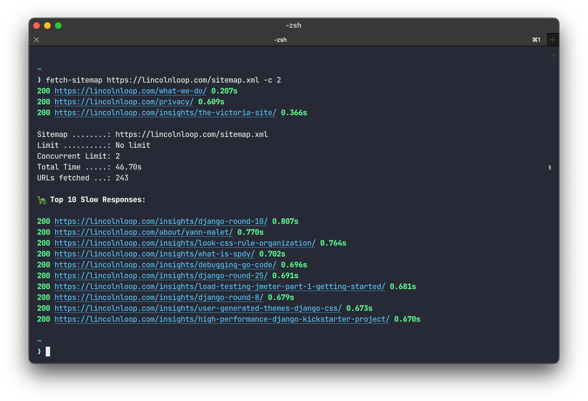

# fetch-sitemap

Retrieves all URL's of a given sitemap.xml URL and fetches each page one by one. 
Useful for (load) testing the entire site for error responses.



*Note:* The default concurrency limit is 10, so 10 URLs are fetched at once. 
Depending on your server's worker count, this might already be enough to DOS it.
Try `--concurrency-limit=2` and scale up if necessary.

```
usage: fetch-sitemap 
    [-h] 
    [--basic-auth BASIC_AUTH] 
    [-l LIMIT] 
    [-c CONCURRENCY_LIMIT] 
    [-t REQUEST_TIMEOUT] 
    [--report-path REPORT_PATH] 
    sitemap_url

Fetch a given sitemap and retrieve all URLs in it.

positional arguments:
  sitemap_url           URL of the sitemap to fetch

options:
  -h, --help            show this help message and exit
  --basic-auth BASIC_AUTH
                        Basic auth information. Use: 'username:password'.
  -l LIMIT, --limit LIMIT
                        Max number of URLs to fetch from the given sitemap.xml. Default: All
  -c CONCURRENCY_LIMIT, --concurrency-limit CONCURRENCY_LIMIT
                        Max number of concurrent requests. Default: 10
  -t REQUEST_TIMEOUT, --request-timeout REQUEST_TIMEOUT
                        Timeout for fetching a URL. Default: 30
  --random              Append a random string like ?12334232343 to each URL to bypass frontend cache. Default: False
  --report-path REPORT_PATH
                        Store results in a CSV file. Example: ./report.csv
```